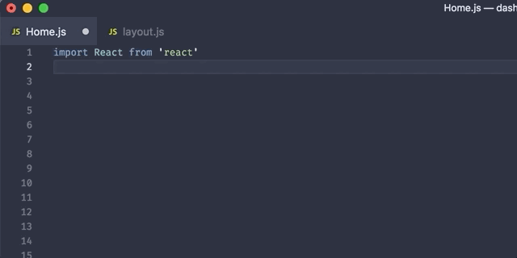

# VSCode React Emotion Snippet

## Installation

Follow the [installation steps here](https://marketplace.visualstudio.com/items?itemName=muhajirdev.vscode-react-emotion) and reload VSCode

## Usage



Simply write `emo` for

```javascript
import styled from "react-emotion";
```

`emoc` for

```javascript
import { css } from "react-emotion";
```

`emosc` for

```javascript
import styled, { css } from "react-emotion";
```

## Who should use this?

- [EmotionJS](https://github.com/emotion-js/emotion) who use ReactJs
- And maybe more?

## Where does this snippet runs?

- `.js`
- `.jsx`
- `.ts`
- `.tsx`

## Release Notes

### 0.1.0

Added support for `.jsx`, and `.tsx`

### 0.0.1

Initial release

## For more information

- [Github](https://github.com/muhajirdev/vscode-react-emotion-snippets)
- Got a question? [Submit an issue](https://github.com/muhajirdev/vscode-react-emotion-snippets/issues/new)

## Contributing

- [Submit an idea](https://github.com/muhajirdev/vscode-react-emotion-snippets/issues/new)
- Make a pull request

## Related

- [vscode-tailwind-styled-snippets](https://github.com/muhajirdev/vscode-tailwind-styled-snippets)

**Enjoy!**
